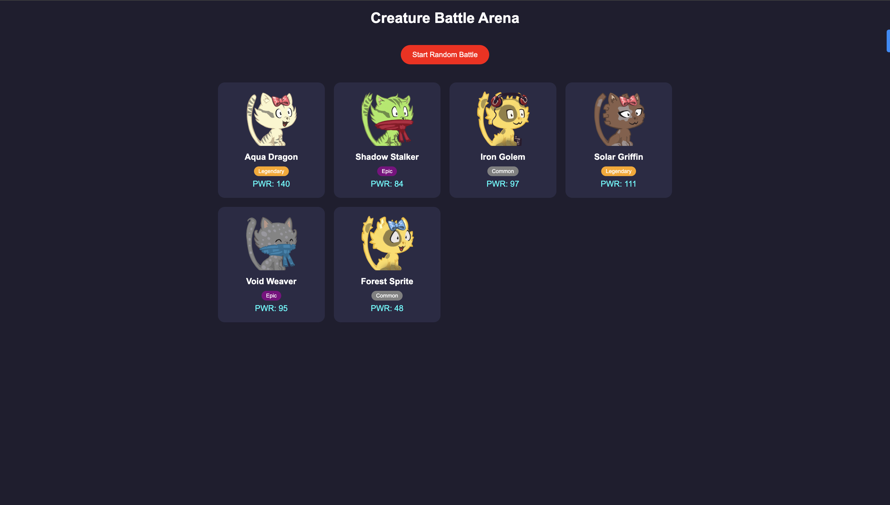

**The Logic is**
```
Data (Array of creatures)
        ↓
UI Render
        ↓
User Click
        ↓
Random Selection
        ↓
Compare
        ↓
Modify Data
        ↓
Re-render
```
```
This is called:

State → Update → Render Cycle
```
 


@The copy right deserves to ThuRein-110 Github acc.
