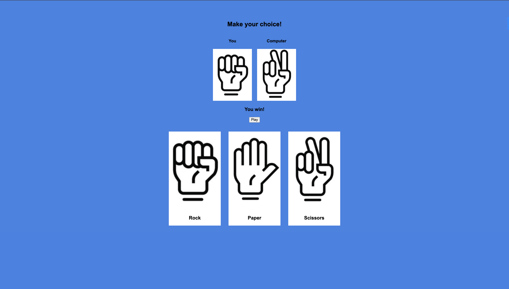

# Rock Paper Scissors Game

A simple **Rock Paper Scissors game** built with **HTML, CSS, and JavaScript**. Users can click on Rock, Paper, or Scissors to play against the computer. The game displays both the player’s and computer’s choices and shows the result of each round.

---

## 🎮 Features

- Click on **Rock, Paper, or Scissors** to make your choice.
- The computer randomly selects its choice.
- Displays **player and computer images** side by side.
- Shows the **game result**: Win, Lose, or Tie.
- Optional **Play button** for random automatic play.

---

## 📁 Project Structure

```
/project
│ index.html
│ style.css
│ script.js
└───img
rock.jpg
paper.jpg
scissors.jpg
```

- `index.html` – Main HTML file.
- `style.css` – Styles for the game.
- `script.js` – Game logic and interactivity.
- `img/` – Images for Rock, Paper, and Scissors.

---

## ⚡ How to Run

1. Clone or download this repository.
2. Make sure all images (`rock.jpg`, `paper.jpg`, `scissors.jpg`) are in the `img` folder.
3. Open `index.html` in your browser.
4. Click on a choice or the Play button to start the game.

---

## 🛠 Technology Used

- **HTML5** – Game structure
- **CSS3** – Styling and layout
- **JavaScript** – Game logic and interactivity

---

## 👨‍💻 How it Works

1. Player clicks on a choice (`Rock`, `Paper`, `Scissors`).
2. JavaScript randomly picks the computer's choice.
3. The game compares the player’s and computer’s choice.
4. Displays **result text** and **both images**.
5. Optional button triggers a random game.

---

## 📸 Screenshot

 

---

## 🎯 License

This project is **open source** and free to use.